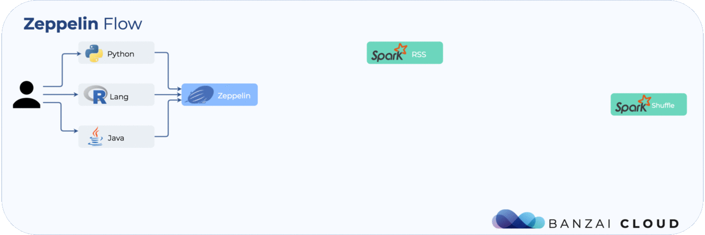

# References
   * https://zeppelin.apache.org/docs/0.10.0/quickstart/kubernetes.html
      * See "Accessing Spark UI (or Service running in interpreter Pod)" 
   * https://github.com/apache/zeppelin/blob/master/docs/quickstart/kubernetes.md
   * https://github.com/apache/zeppelin/commit/2f55fe8ed277b28d71f858633f9c9d76fd18f0c3: [ZEPPELIN-5565] Support Spark 3.2