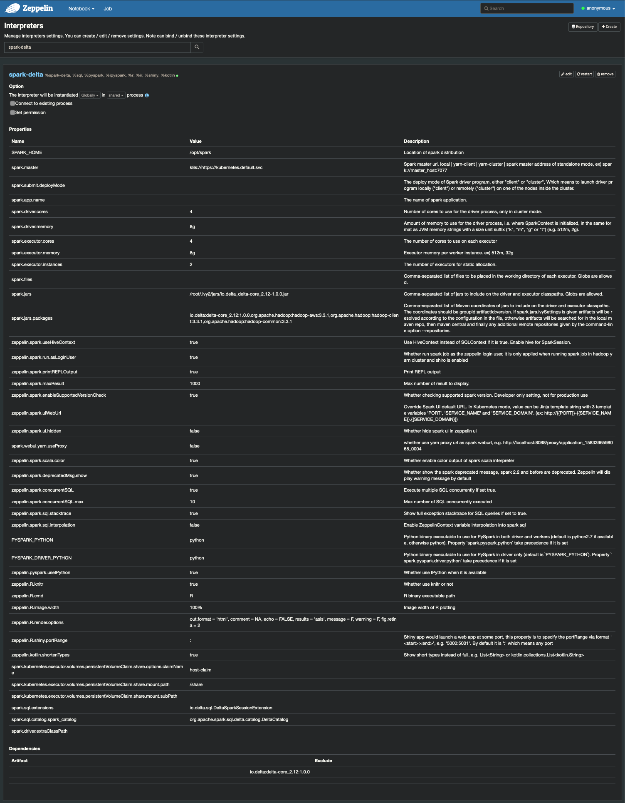

# Docker containers
   * [Official Spark container](https://raw.githubusercontent.com/rogeriomm/spark-k8s/cd390fc25a6824bcd9859b2674b3df568d2a4d2e/base/docker-spark-create-image.sh) 
      * [Dockerfile base](https://github.com/rogeriomm/spark-k8s/blob/cd390fc25a6824bcd9859b2674b3df568d2a4d2e/base/Dockerfile)
         * [Dockerfile base-python](https://github.com/rogeriomm/spark-k8s/blob/cd390fc25a6824bcd9859b2674b3df568d2a4d2e/base-python/Dockerfile)
            * [Dockerfile zeppelin](https://github.com/rogeriomm/zeppelin-k8s/blob/5c13f6d5f1fb070e054fefe5b21a0360bd14923f/zeppelin/Dockerfile)
               * [Dockerfile zeppelin-custom (Debug)](https://github.com/rogeriomm/zeppelin-k8s/blob/5c13f6d5f1fb070e054fefe5b21a0360bd14923f/zeppelin-custom/Dockerfile) 

# Kubernetes yaml
   * [Create persistent volumes](https://github.com/rogeriomm/minikube-labtools-k8s/blob/72a965bc45b307a0a6422fd8322c8dea93523be7/yaml/persistent-volumes.yaml)
```commandline
kubectl apply -f persistent-volumes.yaml
```

   * [Create zeppelin cluster](https://github.com/rogeriomm/zeppelin-k8s/tree/5c13f6d5f1fb070e054fefe5b21a0360bd14923f/k8s/yaml)
```commandline
cd zeppelin-k8s/k8s
kubectl apply -f yaml
```

   * [Custom Jinja Zeppelin interpreter file](https://github.com/rogeriomm/zeppelin-k8s/blob/master/k8s/interpreter/100-interpreter-spec.yaml)
     * Based on [original zeppelin template](https://github.com/apache/zeppelin/blob/master/k8s/interpreter/100-interpreter-spec.yaml)
        * Removed init container specification
        * Added persistent volume claim

# Zeppelin interpreter configuration
## Delta
   * [Zeppelin interpreter.json file](https://github.com/rogeriomm/zeppelin-k8s/blob/master/conf_10/interpreter.json) view


# Sample Zeppelin notebooks
   * [Delta lake sample using filesystem](https://github.com/rogeriomm/zeppelin-k8s/blob/master/notebook_10/DeltaLake/tutorial-1_2GJ5BXZY7.zpln)
   * Delta lake using MINIO S3 (TODO)
# Issues
## Spark init container error
   * https://kubernetes.io/docs/tasks/debug-application-cluster/debug-init-containers/
   * https://github.com/apache/zeppelin/blob/master/k8s/interpreter/100-interpreter-spec.yaml
   * https://github.com/apache/zeppelin/blob/master/k8s/zeppelin-server.yaml: Zeppelin k8s sample
   * https://kubernetes.io/docs/concepts/workloads/pods/init-containers/: Init Containers

# References
   * https://jboothomas.medium.com/running-spark-on-kubernetes-with-persistent-storage-24b7903bb40a: Running spark on Kubernetes with persistent storage 😎
   * https://doc.lucidworks.com/spark-guide/11031/running-spark-on-kubernetes#using-kubernetes-volumes: Running Spark on Kubernetes 
   * https://zeppelin.apache.org/docs/0.10.0/interpreter/spark.html#dependency-management 
   * https://zeppelin.apache.org/docs/0.10.0/quickstart/kubernetes.html: Zeppelin on Kubernetes
